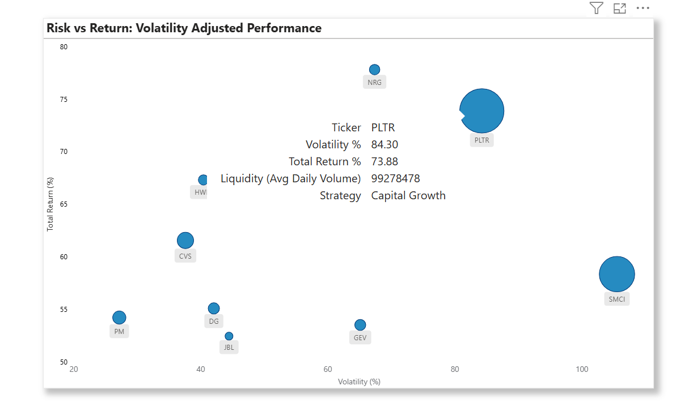

# 📈Stock-Performance-Analysis-H1-2025

  

## Overview
This python-powered interactive dashboard was built to analyze **S&P 500 stock performance in H1 2025**, using real-time data from Yahoo Finance and Dividend Aristocrats. Includes strategy segmentation, custom scoring, risk-return visualization, and performance snapshots.  

## Dashboard File  
My final dashboard is in [Stock-Performance-Dashboard](Outputs/Dashboard.main.png)  

## Objective

To provide investors with a clear, data-driven view of how different stocks performed in the first half of 2025, based on their investment goals, using:

- 📊 Historical price trend
- 💵 Dividend performance
- ✅ Strategy based filtering

## Key Features

- ✅ Dynamic scoring model for evaluating stocks across multiple investment goals
- 📊 Visualization of top 10 stocks in each category
- 🗃️ Clean project structure with reproducible code and documentation

## Tools & Libraries

- **Python** (Pandas, yfinance)
- **Excel / Power BI** (Dashboard rendering)
- **Jupyter Notebook** (Exploratory analysis)
- **Git & GitHub** (Version control)

## Visual Insights

### Return Breakdown

  

- Design choice: Horizontal bar chart for intuitive comparison of price and dividend returns side by side. The highlighted chart spotlights the top performing stocks across all three strategies, making it easy to assess return potential among high growth picks.

- Insight Gained: NRG, followed by PLTR led all stocks in total return, driven by strong price growth. However, strong price growth does not guarantee a good buy. Investors need to evaluate internal performance as well as external risk factors and valuation metrics before making any investment decision.

### Strategy Classification Logic
```
def assign_strategy(row):
    
    if row["Ticker"] in aristocrat_tickers:
        return "Income-Focused"
    elif row["Price Return %"] >=10 and row["Dividend Yield %"] <1:
        return "Growth-Focused"
    elif row["Price Return %"] >=5 and row["Dividend Yield %"] >= 1:
        return "Balanced"
    else:
        return "Unclassified"
```

### Strategy Selection Criteria & Explanation
This logic dynamically classifies stocks into investment strategies - growth focused (capital growth), income focused (dividend income) or balanced (a blend of both), based on return and dividend yield thresholds. 

✅ Income-Focused (Dividend Income)
- Criteria: Member of the dividend aristocrats index.

- Explanation: These are high quality dividend paying stocks with a 25+ year history of increasing payouts, ideal for income seeking investors.

✅ Growth-Focused (Capital Growth)
- Criteria:
   - Price Return ≥ 10%
   - Dividend Yield < 1%
 
- Explanation: Stocks with strong capital appreciation and minimal dividend payout. Typically reinvest profits for expansion. Suited for growth driven investors.

✅ Balanced 
- Criteria:
  - Price Return ≥ 5%
  - Dividend Yield ≥ 1%

- Explanation: Stocks that offer a blend of dividend income and price growth, ideal for investors seeking moderate, steady performance.

This helps segment top-performing stocks according to distinct investor goals, allowing clearer analysis and targeted insights.


### Risk vs Return Map



- Design choice: Scatter plot with bubble size to visualize the trade-off between risk (volatility) and return, helping investors quickly spot smart buys like high return, low volatility stocks.

- Insight Gained: Some stocks like NRG offer high returns with relatively low volatility, signaling strong performance with manageable risk, potential smart buys. On the other hand, stocks like SMCI show high volatility with modest returns, indicating higher uncertainty. This visualization helps investors weigh the trade-off between return and stability, making it easier to identify well balanced opportunities versus risk heavy plays.


### Best Performers (Scoring Model)


- Design choice: Horizontal bar chart for intuitive comparison of top 10 stocks ranked by my custom scoring model, that blends key performance indicators including return, dividend strength, risk, liquidity, quality(ROE), and value(P/E ratio), into a single composite score.

- Insight Gained: HCA ranked highest in the custom scoring model, marking it as a strong all rounder. Ford (F) and CVS followed closely, indicating solid balance across return, dividend, risk and performance metrics.


### Scoring Model Weights


- Design choice: Donurt chart was used to visually communicate how much weight each metric contributes to the overall stock performance score.

- Insight Gained: The scoring model places the highest emphasis on **Quality (25%)** and **Growth (20%)**, indicating a priority on strong fundamentals and upward momentum. Lower weights for **Liquidity (10%)** and other metrics suggest a balanced yet performance driven approach for ranking stocks.

### Custom Scoring Model

```
def normalize(series, inverse=False):
    norm = (series - series.min()) / (series.max() - series.min())
    return 1 - norm if inverse else norm

performers["Score_Value"] = normalize(performers["P/E Ratio"], inverse=True)
performers["Score_Growth"] = normalize(performers["Price Return %"])
performers["Score_Quality"] = normalize(performers["ROE"])
performers["Score_Yield"] = normalize(performers["Dividend Yield %"])
performers["Score_Stability"] = normalize(performers["Volatility %"], inverse=True)
performers["Score_Liquidity"] = normalize(performers["Avg Daily Volume"])


performers["Final Score"] = (
    0.25 * performers["Score_Quality"] +
    0.20 * performers["Score_Growth"] +
    0.15 * performers["Score_Value"]+
    0.15 * performers["Score_Yield"] +
    0.15 * performers["Score_Stability"] +
    0.10 * performers["Score_Liquidity"]
)
```
Scoring logic used to evaluate each stock.
Weighted Score = Quality *0.25* + Growth *0.20* + Value *0.15* + Yield *0.15* + Stability *0.15* + Liquidity *0.10*.  

### Why each metric matters

- Quality: Is a measure of it's Return on Equity (ROE). ROE reflects how efficiently a company uses shareholder's money to generate profits.

- Growth: Shows how fast a company is increasing in revenue, earnings or stock price.

- Value: Is a measure of it's Price to Earnings (P/E) ratio. It helps identify **undervalued** and **overvalued** stocks, priced lower or above their true worth. A low P/E may suggest a bargain opportunity, while a high P/E could indicate either overvaluation or strong growth expectations.
  
- Yield: Shows how much a company pays out in dividends relative to its stock price.
  
- Stability: It protects portfolios from sharp downturns and appeals to investors with lower risk tolerance.
  
- Liquidity: Ensures the stock is easily tradable without major price swings.

## 📝Conclusion

This dashboard isn't just an analytics project, it's a structured guide built for investors who already understand the stock market matrix.

Investors with high to moderate risk tolerance can explore the top performing stocks based on the return breakdown chart, selecting picks that align with their investment goal. 

However, more risk-averse investors can explore top stocks in the custom scoring model. These aren't just ranked by return, they are also evaluated for risk, stability, value and overall performance.

That said, no dashboard replaces due diligence. Behind every high score lies a business with real operations and risks. Investors should still conduct thorough research, reviewing detailed financial statements, assessing internal efficiency, understanding external risk factors and validating valuation metrics before making any investment  decisions.


